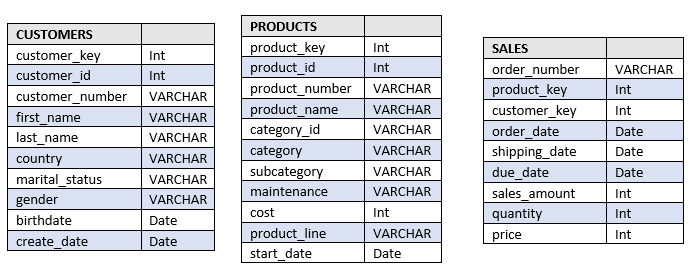

# Sales-dataset-EDA-project-in-SQL

## Project Background

Motionchain is a global e-commerce company that sells premium bike accessories, parts and apparel for enthusiasts worldwide.

The company has significant amount of data on its sales, customers biography, product offerings and cost of maintenance that has been previously underutilized. This project thoroughly analyses and synthesizes this data in order to uncover critical insights that will improve its commercial success.

### Insights and recommendations are provided on the following key areas:

•	Sales Trends Analysis: Evaluation of historical sales patterns both globally and by region, focusing on Revenue, Order Volume, Catalog size and Average Order Value (AOV).

•	Product and Category Performance: Analysis of various product lines and regional demand, understanding their impact on sales and returns.

•	Regional Comparisons: An evaluation of sales and orders by region.

•	Customer Insights & Demographics: Breakdown of customers by gender, age & regions, and total revenue generated by each customer.

SQL queries utilized for data cleaning can be found here.

SQL queries regarding various business questions can be found here.

### Data Structure & Initial Checks

Motionchain’s Database structure consists of 3 tables: customers,products and sales, with a total row count of 56850 records.

### Executive Summary

#### Overview of Findings

The company operates in 6 countries with a portfolio of 295 products across 5 categories and 37 subcategories. Out of 18484 total customers, United States leads as the largest market having 7482 customers (over 40 %).  Overall, the business generated 11.58M in total sales from 15370 orders, reflecting a strong revenue base with moderate order volume.

#### Sales Trends
Sales are heavily concentrated in the bikes category, which contributes the vast majority of total revenue (over 90%). In contrast, accessories and clothing contribute relatively minimal revenue, despite having lower price points and wider accessibility.

The average product cost varies significantly, with bikes being high-value products (avg. cost ≈949), while accessories and clothing are low-cost items. Geographically, USA dominates both in customers and items sold, suggesting it is the most mature and profitable market.

#### Product Performance

Top-performing products are led by Mountain-200 bikes, highlighting strong demand for premium and performance-oriented bikes. Subcategories such as mountain bikes, road bikes, and touring bikes are key revenue drivers.

On the other hand, low-performing products such as socks, patch kits, and cleaning items contribute minimally to sales. Similarly, subcategories like caps, gloves, and vests underperform, indicating weaker customer demand in these areas.

This shows a clear trend: core bike-related products drive business success, while smaller accessory segments have limited impact.

#### Recommendations

Focus on high-performing categories: Increase investment in bikes and top subcategories like mountain and road bikes.

Optimize product portfolio: Re-evaluate or bundle low-performing items (e.g., socks, cleaning products) to improve their contribution.

Expand in high-growth markets: Strengthen presence in top-performing regions like the USA and Australia while exploring growth in underpenetrated markets.

Leverage cross-selling opportunities: Promote accessories and clothing alongside bike purchases to increase overall basket value.

